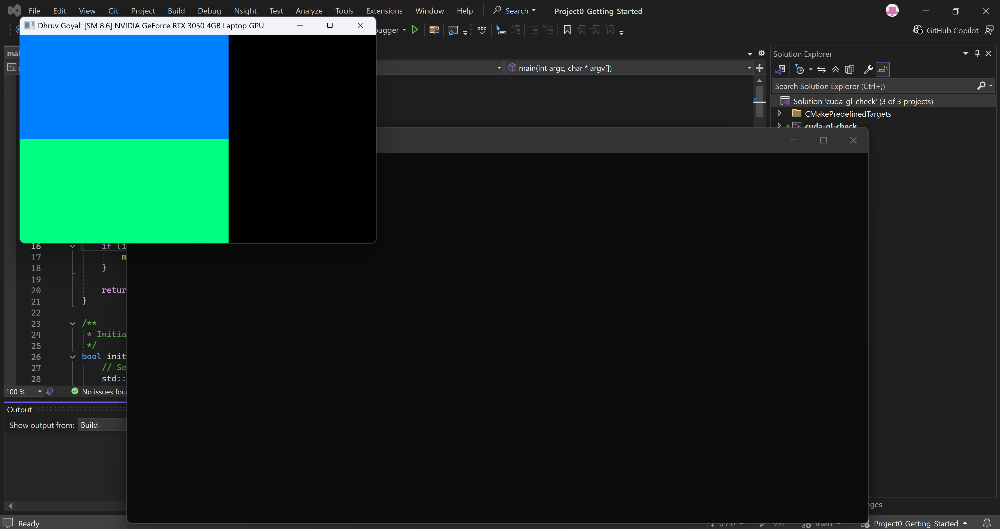
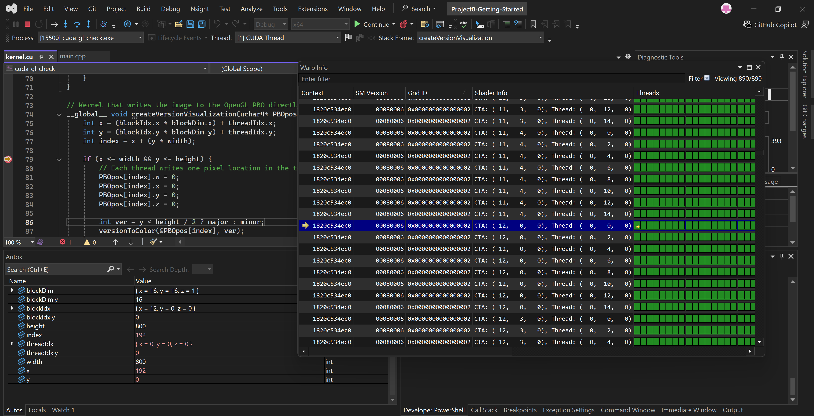
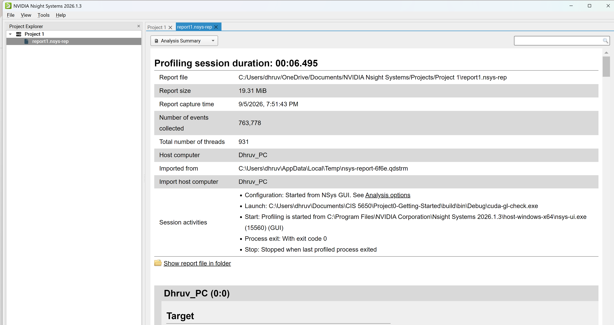
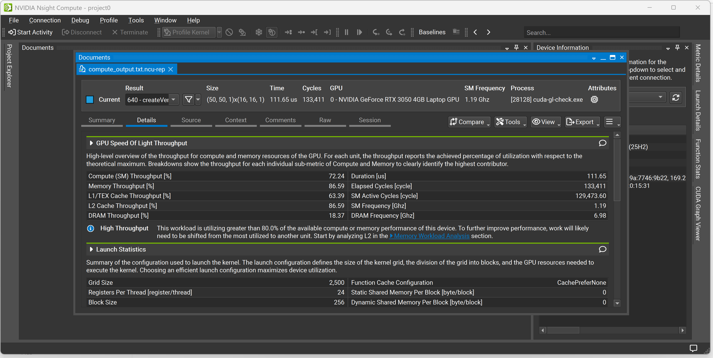
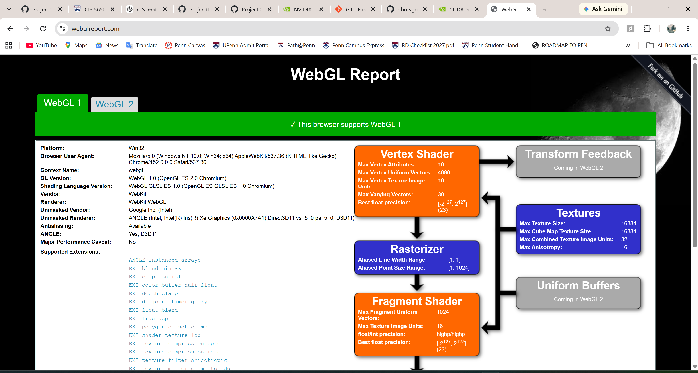
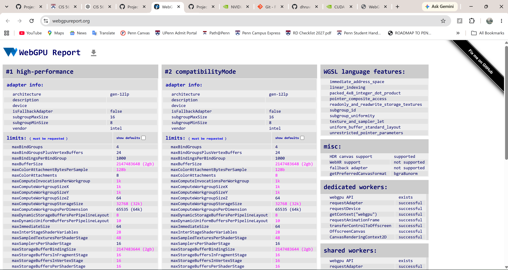

Project 0 Getting Started
====================

**University of Pennsylvania, CIS 5650: GPU Programming and Architecture, Project 0**

* Dhruv Goyal
  * [LinkedIn](https://www.linkedin.com/in/dhruv-goyal-upenn-seas/)
* Tested on: Windows 11, Intel Core i7-1355U @ 1.70 GHz, 32 GB RAM, NVIDIA GeForce RTX 3050 Laptop GPU 4 GB (My Personal Computer)

### (TODO: Your README)

